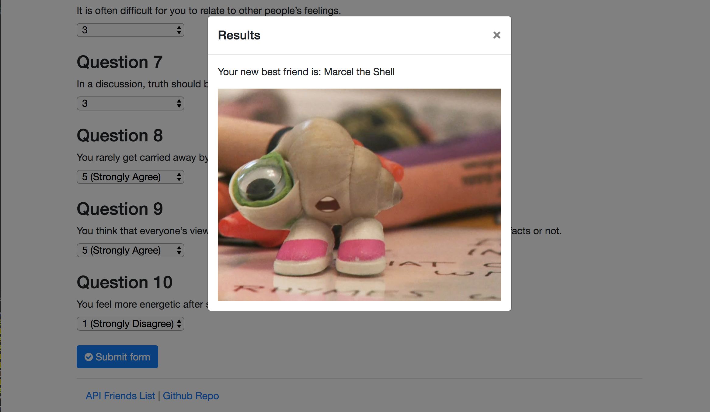

# Friend-Finder

* The Friend Finder is a full-stack site that takes in users' survey answers, compares their answers with those from previous users, and then displays the name and picture of the best overall match.

* The survey includes 10 questions/statements, and each is answered on a scale of 1 to 5 based on how much the user agrees or disagrees with the statement, with 1 being "strongly disagree" and 5 being "strongly agree." Your best match is found by comparing the difference between the current user's scores and all previous users' scores, question by question (this is all done behind-the-scenes, so you get to sit back, relax, and let your new friend come to you!).

* This site uses HTML, CSS, Bootstrap, JavaScript, jQuery, and Express.

* Find your new best friend today!

